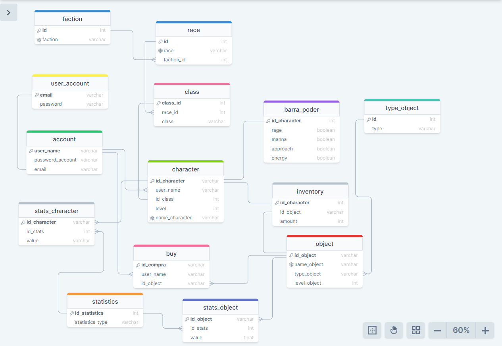

# Tienda de objetos (World of Warcraft)


Se busca desarrollar un sistema integral para la gestión de la venta de objetos en el contexto de World of Warcraft. Los usuarios tienen la posibilidad de poseer múltiples cuentas, cada una de las cuales puede crear hasta un máximo de 10 personajes. Es importante destacar que los objetos adquiridos están vinculados exclusivamente a la cuenta del usuario.

La implementación de este sistema implica un control detallado de las cuentas y los personajes, con el objetivo de restringir el uso o la cantidad máxima permitida de un objeto específico. Esta medida garantiza un manejo eficiente y equitativo de los recursos virtuales, promoviendo un entorno de juego balanceado.

Adicionalmente, los objetos poseen un nivel asociado que determina su utilización, estando condicionado por el nivel del personaje correspondiente. Esta característica añade una capa de complejidad estratégica al juego, ya que los jugadores deben considerar no solo la adquisición de objetos, sino también su nivel de habilidad para aprovechar al máximo su potencial en el campo de batalla.

En resumen, la implementación de este sistema no solo busca facilitar la transacción de objetos en el universo de World of Warcraft, sino que también procura establecer medidas de control y equilibrio para asegurar una experiencia de juego justa y enriquecedora para todos los usuarios.





## Modelo Logico

1. faction
- id (INT PK)
- faction (VARCHAR(20) UNIQUE)

2. race
- id (INT PK)
- race (VARCHAR(30) UNIQUE)

3. class
- class_id (INT PK)
- race_id (INT FK)
- class (VARCHAR(30) UNIQUE)

4. user_account
- email (VARCHAR(50) PK)
- password (VARCHAR(50))

5. account
- user_name (VARCHAR(20) PK)
- password_account (VARCHAR(30))
- email (VARCHAR(50) FK)
- wow_currency (double)
- token_account (VARCHAR(30))

6. type_object
- id (INT PK)
- type (VARCHAR(30))

7. object
- id_object (VARCHAR(50) PK)
- name_object (VARCHAR(50) UNIQUE)
- type_object (ENUM('BlizzObject','at a distance','Trinket','bag','head','shirt','waist','neck','finger','two hands','shield','back','shoudler','right hand','left hand','hands','dolls','feet','tabard','torso','a hand','consumable'))
- leve_object (INT)
- category (ENUM('poor','common','rare','queer','epic','legendary','artifact'))

8. inventory
- id_inventory(INT PK)
- id_character_wow (INT FK)
- id_object (VARCHAR(50) FK)
- amount (INT)

9. statistics
- id_statistics (INT PK)
- statistics_type (VARCHAR(20) UNIQUE)

10. stats_object
- id_stats_object (INT PK)
- id_object (VARCHAR(50) FK)
- id_stats (INT FK)
- value (double)

11. buy
- id_buy (VARCHAR(30) PK)
- user_name (VARCHAR(20) FK)
- id_object (VARCHAR(50) FK)
- token_account (VARCHAR(50) FK)

12. character_wow
- id_character_wow (INT PK)
- user_name (VARCHAR(30))
- id_class (INT FK)
- level (INT)
- name_character_wow (VARCHAR(20) UNIQUE)

13.  locker
- id_locker (INT PK)
- id_account (VARCHAR(30))

14.  locker_object
- id_locker (INT FK)
- id_object (INT FK)

15.  catalogue
- id_producto (INT PK)
- value_wc (DOUBLE)
- id_object (VARCHAR(50) FK)


## Queries

1. Table: `object`
   CRUD:
   CREATE and UPDATE
   - **Procedimiento:** `create_object`
   ```sql
   -- CREATE, UPDATE
   DROP PROCEDURE IF EXISTS create_object;
   DELIMITER //
   CREATE PROCEDURE create_object(
      in $id_object VARCHAR(50),
      in $name_object VARCHAR(50),
      in $type_object ENUM('BlizzObject','at a distance','Trinket','bag','head','shirt','waist','neck','finger','two hands','shield','back','shoudler','right hand','left hand','hands','dolls','feet','tabard','torso','a hand','consumable'),
      in $level_object INT,
      in $category enum('poor','common','rare','queer','epic','legendary','artifact'),
      in $id_class INT
   )
   BEGIN
      DECLARE var_id_object VARCHAR(50);
      SET @object_var = CONCAT('',$id_object,'');

      SELECT o.id_object INTO var_id_object 
      FROM object o
      WHERE o.id_object LIKE @object_var;

      IF var_id_object IS NULL
      THEN
         INSERT INTO object
         (id_object,name_object,type_object,level_object,category,id_class) 
         VALUES ($id_object,$name_object,$type_object,$level_object,$category,$id_class);
      ELSE   
         UPDATE object
         SET 
               name_object = $name_object,
               type_object = $type_object,
               level_object = $level_object,
               category = $category,
               id_class = $id_class
         WHERE id_object = var_id_object;

      END IF;
   END //
   DELIMITER ;
   ```

   DELETE
     - **Procedimiento:** `delete_object_cascade`
     - **Parametros:** `IN i_id_object VARCHAR(50)`
     ```sql
     DROP PROCEDURE IF EXISTS delete_object_cascade;
     DELIMITER //
     CREATE PROCEDURE delete_object_cascade(IN i_id_object VARCHAR(50))
     BEGIN
        DECLARE idObject VARCHAR(50);

        DECLARE EXIT HANDLER FOR SQLEXCEPTION
        BEGIN
           ROLLBACK;
           SELECT 'An error occurred' as Message;
        END;

        START TRANSACTION;

        SELECT o.id_object INTO idObject FROM object o WHERE o.id_object = i_id_object;

        IF idObject IS NOT NULL 
        THEN
           DELETE FROM stats_object so
           WHERE so.id_object = idObject;

           DELETE FROM locker_object lo
           WHERE lo.id_object = idObject;

           DELETE FROM buy b
           WHERE b.id_object = idObject;

           DELETE FROM catalogue c
           WHERE c.id_object = idObject;

           DELETE FROM object o
           WHERE o.id_object = idObject;
        ELSE
           SELECT 'Object not Found';
        END IF;

        COMMIT;

     END //
     DELIMITER ;
     ```

   SELECT
      ```sql
      SELECT * FROM object;
      ```
   1. Consigue todos los objetos de una clase.
   - **Procedimiento:**  `getAll_object_by_class`
   - **Parametros:** `class`
   example:
   ```sql
    SELECT *
    FROM object o
    WHERE o.id_class = (
      SELECT cclass_id 
      FROM class c
      WHERE c.class like 'Shaman'
   );
   ```
   2. Obtener categoría y tipos que no tienen objetos.
   - **Procedimiento:**  `getAll_category_and_type`
   ```sql
   SELECT o.category, GROUP_CONCAT(DISTINCT o.type_object)
   FROM object o
   WHERE o.category IN (SELECT category FROM object)
   AND o.type_object IN (SELECT type_object FROM object)
   GROUP BY o.category;
   ```
   3. Consigue todos los objetos y ordénalos por nivel.
   - **Procedimiento:**  `getAll_object_order_by_level`
   ```sql
   SELECT o.*
   FROM object o
   ORDER BY o.level_object; 
   ```
   4. Obtener las categorias de los objetos que han sido comprados
   - **Procedimiento:**  ``
   ```sql
    SELECT o.category, COUNT(*) as count
    FROM object o
    WHERE o.id_object = ANY(SELECT b.id_object FROM buy b)
    GROUP BY o.category;
   ```
   5. Obténer id de los objetos con ssu clase, raza y facción.
   - **Procedimiento:**  `getAll_object_class_race_faction`
   ```sql
    SELECT o.id_object, o.name_object, c.class, r.race, f.faction_name 
    FROM object o,class c, race r, faction f
    WHERE o.id_class = c.class_id
    AND c.race_id = r.id
    AND r.faction_id = f.id;
   ```

2. Table: `faction`
   CRUD:
   CREATE - UPDATE
      ```sql
      
      ```
   DELETE
      ```sql

      ```
   SELECT
      ```sql
      SELECT * FROM faction
      ```
   1. query 1
   - **Procedimiento:**  ``
   ```sql
   ```
   1. query 2
   - **Procedimiento:**  ``
   ```sql
   ```
   1. query 3
   - **Procedimiento:**  ``
   ```sql
   ```
   1. query 4
   - **Procedimiento:**  ``
   ```sql
   ```
   1. query 5
   - **Procedimiento:**  ``
   ```sql
   ```
3. Table: `buy`
   CRUD:
   ```sql
   ```
   1. query 1
   - **Procedimiento:**  ``
   ```sql
   ```
   1. query 2
   - **Procedimiento:**  ``
   ```sql
   ```
   1. query 3
   - **Procedimiento:**  ``
   ```sql
   ```
   1. query 4
   - **Procedimiento:**  ``
   ```sql
   ```
   1. query 5
   - **Procedimiento:**  ``
   ```sql
   ```
4. Table: `stats_object`
   CRUD:
   ```sql
   ```
   1. query 1
   - **Procedimiento:**  ``
   ```sql
   ```
   1. query 2
   - **Procedimiento:**  ``
   ```sql
   ```
   1. query 3
   - **Procedimiento:**  ``
   ```sql
   ```
   1. query 4
   - **Procedimiento:**  ``
   ```sql
   ```
   1. query 5
   - **Procedimiento:**  ``
   ```sql
   ```
5. Table: `inventory`
   CRUD:
   ```sql
   ```
   1. query 1
   - **Procedimiento:**  ``
   ```sql
   ```
   1. query 2
   - **Procedimiento:**  ``
   ```sql
   ```
   1. query 3
   - **Procedimiento:**  ``
   ```sql
   ```
   1. query 4
   - **Procedimiento:**  ``
   ```sql
   ```
   1. query 5
   - **Procedimiento:**  ``
   ```sql
   ```
6. Table: `statistics`
   CRUD:
   ```sql
   ```
   1. query 1
   - **Procedimiento:**  ``
   ```sql
   ```
   1. query 2
   - **Procedimiento:**  ``
   ```sql
   ```
   1. query 3
   - **Procedimiento:**  ``
   ```sql
   ```
   1. query 4
   - **Procedimiento:**  ``
   ```sql
   ```
   1. query 5
   - **Procedimiento:**  ``
   ```sql
   ```
7. Table: `character_wow`
   CRUD:
   ```sql
   ```
   1. query 1
   - **Procedimiento:**  ``
   ```sql
   ```
   1. query 2
   - **Procedimiento:**  ``
   ```sql
   ```
   1. query 3
   - **Procedimiento:**  ``
   ```sql
   ```
   1. query 4
   - **Procedimiento:**  ``
   ```sql
   ```
   1. query 5
   - **Procedimiento:**  ``
   ```sql
   ```
8. Table: `account`
   CRUD:
   ```sql
   ```
   1. query 1
   - **Procedimiento:**  ``
   ```sql
   ```
   1. query 2
   - **Procedimiento:**  ``
   ```sql
   ```
   1. query 3
   - **Procedimiento:**  ``
   ```sql
   ```
   1. query 4
   - **Procedimiento:**  ``
   ```sql
   ```
   1. query 5
   - **Procedimiento:**  ``
   ```sql
   ```
9.  Table: `user_account`
   CRUD:
   ```sql
   ```
   1. query 1
   - **Procedimiento:**  ``
   ```sql
   ```
   1. query 2
   - **Procedimiento:**  ``
   ```sql
   ```
   1. query 3
   - **Procedimiento:**  ``
   ```sql
   ```
   1. query 4
   - **Procedimiento:**  ``
   ```sql
   ```
   1. query 5
   - **Procedimiento:**  ``
   ```sql
   ```
10. Table: `locker_object`
   CRUD:
   ```sql
   ```
   1. query 1
   - **Procedimiento:**  ``
   ```sql
   ```
   1. query 2
   - **Procedimiento:**  ``
   ```sql
   ```
   1. query 3
   - **Procedimiento:**  ``
   ```sql
   ```
   1. query 4
   - **Procedimiento:**  ``
   ```sql
   ```
   1. query 5
   - **Procedimiento:**  ``
   ```sql
   ```
11. Table: `catalogue`
   CRUD:
   ```sql
   ```
   1. query 1
   - **Procedimiento:**  ``
   ```sql
   ```
   1. query 2
   - **Procedimiento:**  ``
   ```sql
   ```
   1. query 3
   - **Procedimiento:**  ``
   ```sql
   ```
   1. query 4
   - **Procedimiento:**  ``
   ```sql
   ```
   1. query 5
   - **Procedimiento:**  ``
   ```sql
   ```
12. Table: `locker`
   CRUD:
   ```sql
   ```
   1. query 1
   - **Procedimiento:**  ``
   ```sql
   ```
   1. query 2
   - **Procedimiento:**  ``
   ```sql
   ```
   1. query 3
   - **Procedimiento:**  ``
   ```sql
   ```
   1. query 4
   - **Procedimiento:**  ``
   ```sql
   ```
   1. query 5
   - **Procedimiento:**  ``
   ```sql
   ```
13. Table: `race`
   CRUD:
   ```sql
   ```
   1. query 1
   - **Procedimiento:**  ``
   ```sql
   ```
   1. query 2
   - **Procedimiento:**  ``
   ```sql
   ```
   1. query 3
   - **Procedimiento:**  ``
   ```sql
   ```
   1. query 4
   - **Procedimiento:**  ``
   ```sql
   ```
   1. query 5
   - **Procedimiento:**  ``
   ```sql
   ```
14. Table: `class`
   CRUD:
   ```sql
   ```
   1. query 1
   - **Procedimiento:**  ``
   ```sql
   ```
   1. query 2
   - **Procedimiento:**  ``
   ```sql
   ```
   1. query 3
   - **Procedimiento:**  ``
   ```sql
   ```
   1. query 4
   - **Procedimiento:**  ``
   ```sql
   ```
   1. query 5
   - **Procedimiento:**  ``
   ```sql
   ```
