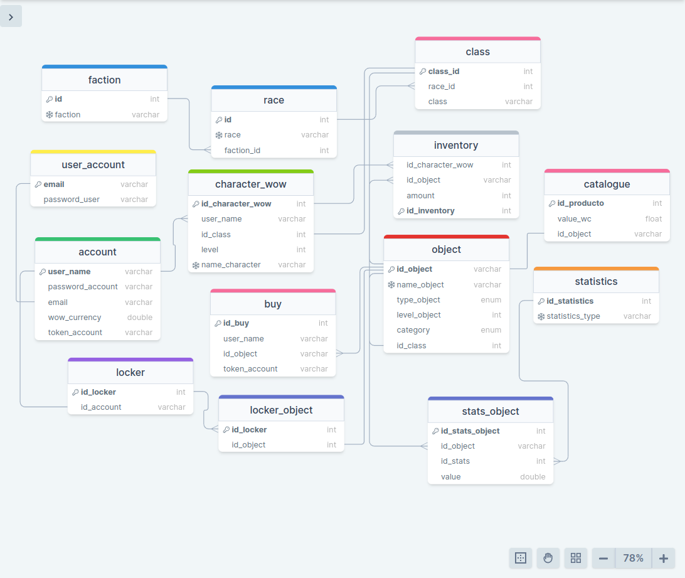

# Item Shop (World of Warcraft)


Se busca desarrollar un sistema integral para la gestión de la venta de objetos en el contexto de World of Warcraft. Los usuarios tienen la posibilidad de poseer múltiples cuentas, cada una de las cuales puede crear hasta un máximo de 10 personajes. Es importante destacar que los objetos adquiridos están vinculados exclusivamente a la cuenta del usuario.

La implementación de este sistema implica un control detallado de las cuentas y los personajes, con el objetivo de restringir el uso o la cantidad máxima permitida de un objeto específico. Esta medida garantiza un manejo eficiente y equitativo de los recursos virtuales, promoviendo un entorno de juego balanceado.

Adicionalmente, los objetos poseen un nivel asociado que determina su utilización, estando condicionado por el nivel del personaje correspondiente. Esta característica añade una capa de complejidad estratégica al juego, ya que los jugadores deben considerar no solo la adquisición de objetos, sino también su nivel de habilidad para aprovechar al máximo su potencial en el campo de batalla.

En resumen, la implementación de este sistema no solo busca facilitar la transacción de objetos en el universo de World of Warcraft, sino que también procura establecer medidas de control y equilibrio para asegurar una experiencia de juego justa y enriquecedora para todos los usuarios.





## Modelo Logico

1. faction
- id (INT PK)
- faction (VARCHAR(20) UNIQUE)

2. race
- id (INT PK)
- race (VARCHAR(30) UNIQUE)

3. class
- class_id (INT PK)
- race_id (INT FK)
- class (VARCHAR(30) UNIQUE)

4. user_account
- email (VARCHAR(50) PK)
- password (VARCHAR(50))

5. account
- user_name (VARCHAR(20) PK)
- password_account (VARCHAR(30))
- email (VARCHAR(50) FK)
- wow_currency (double)
- token_account (VARCHAR(30))

6. type_object
- id (INT PK)
- type (VARCHAR(30))

7. object
- id_object (VARCHAR(50) PK)
- name_object (VARCHAR(50) UNIQUE)
- type_object (ENUM('BlizzObject','at a distance','Trinket','bag','head','shirt','waist','neck','finger','two hands','shield','back','shoudler','right hand','left hand','hands','dolls','feet','tabard','torso','a hand','consumable'))
- leve_object (INT)
- category (ENUM('poor','common','rare','queer','epic','legendary','artifact'))

8. inventory
- id_inventory(INT PK)
- id_character_wow (INT FK)
- id_object (VARCHAR(50) FK)
- amount (INT)

9. statistics
- id_statistics (INT PK)
- statistics_type (VARCHAR(20) UNIQUE)

10. stats_object
- id_stats_object (INT PK)
- id_object (VARCHAR(50) FK)
- id_stats (INT FK)
- value (double)

11. buy
- id_buy (VARCHAR(30) PK)
- user_name (VARCHAR(20) FK)
- id_object (VARCHAR(50) FK)
- token_account (VARCHAR(50) FK)

12. character_wow
- id_character_wow (INT PK)
- user_name (VARCHAR(30))
- id_class (INT FK)
- level (INT)
- name_character_wow (VARCHAR(20) UNIQUE)

13.  locker
- id_locker (INT PK)
- id_account (VARCHAR(30))

14.  locker_object
- id_locker (INT FK)
- id_object (INT FK)

15.  catalogue
- id_producto (INT PK)
- value_wc (DOUBLE)
- id_object (VARCHAR(50) FK)


## Queries

1. Table: `object`
   CRUD:
   ```sql
   ```
   1. Get all objects of a class.
   - **Procedimiento:**  ``
   ```sql
   ```
   2. Get category and types that do not have objects
   - **Procedimiento:**  ``
   ```sql
   ```
   3. Get all objects and sort by level
   - **Procedimiento:**  ``
   ```sql
   ```
   4. Obtain object whose category has been purchased
   - **Procedimiento:**  ``
   ```sql
   ```
   5. Obtain items with your class, race and faction
   - **Procedimiento:**  ``
   ```sql
   ```

2. Table: `faction`
   CRUD:
   ```sql
   ```
   1. query 1
   - **Procedimiento:**  ``
   ```sql
   ```
   2. query 2
   - **Procedimiento:**  ``
   ```sql
   ```
   3. query 3
   - **Procedimiento:**  ``
   ```sql
   ```
   4. query 4
   - **Procedimiento:**  ``
   ```sql
   ```
   5. query 5
   - **Procedimiento:**  ``
   ```sql
   ```
3. Table: `buy`
   CRUD:
   ```sql
   ```
   1. query 1
   - **Procedimiento:**  ``
   ```sql
   ```
   2. query 2
   - **Procedimiento:**  ``
   ```sql
   ```
   3. query 3
   - **Procedimiento:**  ``
   ```sql
   ```
   4. query 4
   - **Procedimiento:**  ``
   ```sql
   ```
   5. query 5
   - **Procedimiento:**  ``
   ```sql
   ```
4. Table: `stats_object`
   CRUD:
   ```sql
   ```
   1. query 1
   - **Procedimiento:**  ``
   ```sql
   ```
   2. query 2
   - **Procedimiento:**  ``
   ```sql
   ```
   3. query 3
   - **Procedimiento:**  ``
   ```sql
   ```
   4. query 4
   - **Procedimiento:**  ``
   ```sql
   ```
   5. query 5
   - **Procedimiento:**  ``
   ```sql
   ```
5. Table: `inventory`
   CRUD:
   ```sql
   ```
   1. query 1
   - **Procedimiento:**  ``
   ```sql
   ```
   2. query 2
   - **Procedimiento:**  ``
   ```sql
   ```
   3. query 3
   - **Procedimiento:**  ``
   ```sql
   ```
   4. query 4
   - **Procedimiento:**  ``
   ```sql
   ```
   5. query 5
   - **Procedimiento:**  ``
   ```sql
   ```
6. Table: `statistics`
   CRUD:
   ```sql
   ```
   1. query 1
   - **Procedimiento:**  ``
   ```sql
   ```
   2. query 2
   - **Procedimiento:**  ``
   ```sql
   ```
   3. query 3
   - **Procedimiento:**  ``
   ```sql
   ```
   4. query 4
   - **Procedimiento:**  ``
   ```sql
   ```
   5. query 5
   - **Procedimiento:**  ``
   ```sql
   ```
7. Table: `character_wow`
   CRUD:
   ```sql
   ```
   1. query 1
   - **Procedimiento:**  ``
   ```sql
   ```
   2. query 2
   - **Procedimiento:**  ``
   ```sql
   ```
   3. query 3
   - **Procedimiento:**  ``
   ```sql
   ```
   4. query 4
   - **Procedimiento:**  ``
   ```sql
   ```
   5. query 5
   - **Procedimiento:**  ``
   ```sql
   ```
8. Table: `account`
   CRUD:
   ```sql
   ```
   1. query 1
   - **Procedimiento:**  ``
   ```sql
   ```
   2. query 2
   - **Procedimiento:**  ``
   ```sql
   ```
   3. query 3
   - **Procedimiento:**  ``
   ```sql
   ```
   4. query 4
   - **Procedimiento:**  ``
   ```sql
   ```
   5. query 5
   - **Procedimiento:**  ``
   ```sql
   ```
9.  Table: `user_account`
   CRUD:
   ```sql
   ```
   1. query 1
   - **Procedimiento:**  ``
   ```sql
   ```
   2. query 2
   - **Procedimiento:**  ``
   ```sql
   ```
   3. query 3
   - **Procedimiento:**  ``
   ```sql
   ```
   4. query 4
   - **Procedimiento:**  ``
   ```sql
   ```
   5. query 5
   - **Procedimiento:**  ``
   ```sql
   ```
10. Table: `locker_object`
   CRUD:
   ```sql
   ```
   1. query 1
   - **Procedimiento:**  ``
   ```sql
   ```
   2. query 2
   - **Procedimiento:**  ``
   ```sql
   ```
   3. query 3
   - **Procedimiento:**  ``
   ```sql
   ```
   4. query 4
   - **Procedimiento:**  ``
   ```sql
   ```
   5. query 5
   - **Procedimiento:**  ``
   ```sql
   ```
11. Table: `catalogue`
   CRUD:
   ```sql
   ```
   1. query 1
   - **Procedimiento:**  ``
   ```sql
   ```
   2. query 2
   - **Procedimiento:**  ``
   ```sql
   ```
   3. query 3
   - **Procedimiento:**  ``
   ```sql
   ```
   4. query 4
   - **Procedimiento:**  ``
   ```sql
   ```
   5. query 5
   - **Procedimiento:**  ``
   ```sql
   ```
12. Table: `locker`
   CRUD:
   ```sql
   ```
   1. query 1
   - **Procedimiento:**  ``
   ```sql
   ```
   2. query 2
   - **Procedimiento:**  ``
   ```sql
   ```
   3. query 3
   - **Procedimiento:**  ``
   ```sql
   ```
   4. query 4
   - **Procedimiento:**  ``
   ```sql
   ```
   5. query 5
   - **Procedimiento:**  ``
   ```sql
   ```
13. Table: `race`
   CRUD:
   ```sql
   ```
   1. query 1
   - **Procedimiento:**  ``
   ```sql
   ```
   2. query 2
   - **Procedimiento:**  ``
   ```sql
   ```
   3. query 3
   - **Procedimiento:**  ``
   ```sql
   ```
   4. query 4
   - **Procedimiento:**  ``
   ```sql
   ```
   5. query 5
   - **Procedimiento:**  ``
   ```sql
   ```
14. Table: `class`
   CRUD:
   ```sql
   ```
   1. query 1
   - **Procedimiento:**  ``
   ```sql
   ```
   2. query 2
   - **Procedimiento:**  ``
   ```sql
   ```
   3. query 3
   - **Procedimiento:**  ``
   ```sql
   ```
   4. query 4
   - **Procedimiento:**  ``
   ```sql
   ```
   5. query 5
   - **Procedimiento:**  ``
   ```sql
   ```
